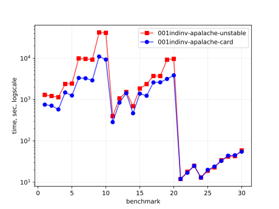
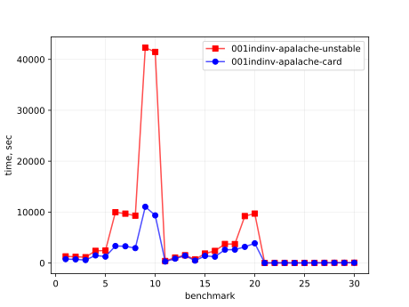
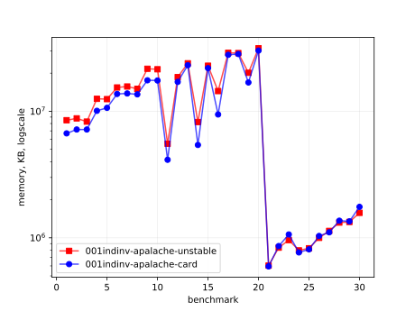
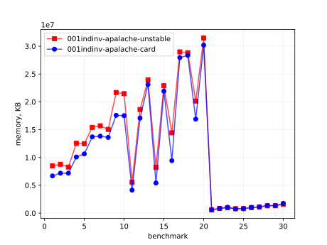
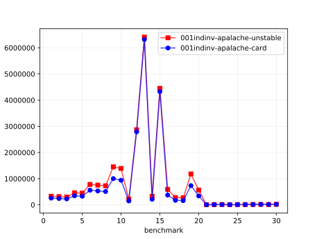
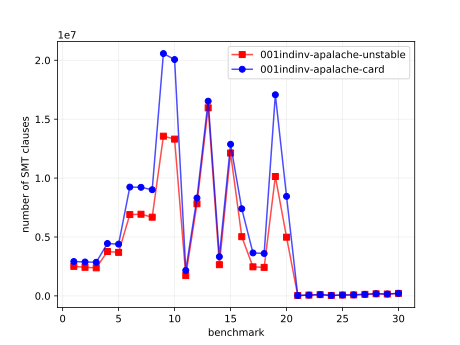

# Results of 001indinv-apalache

## 1. Awesome plots

### 1.1. Time (logarithmic scale)

### 1.2. Time (linear)

### 1.3. Memory (logarithmic scale)

### 1.4. Memory (linear)

### 1.5. Number of arena cells (linear)

### 1.6. Number of SMT clauses (linear)

## 2. Input parameters

no  |  filename       |  tool      |  timeout  |  init      |  inv                               |  next  |  args
----|-----------------|------------|-----------|------------|------------------------------------|--------|------------------------------
1   |  MC_n4_f1.tla   |  apalache  |  10h      |  TypedInv  |  TypedInv                          |        |  --length=1 --cinit=ConstInit
2   |  MC_n4_f2.tla   |  apalache  |  10h      |  TypedInv  |  TypedInv                          |        |  --length=1 --cinit=ConstInit
3   |  MC_n4_f3.tla   |  apalache  |  10h      |  TypedInv  |  TypedInv                          |        |  --length=1 --cinit=ConstInit
4   |  MC_n5_f1.tla   |  apalache  |  10h      |  TypedInv  |  TypedInv                          |        |  --length=1 --cinit=ConstInit
5   |  MC_n5_f2.tla   |  apalache  |  10h      |  TypedInv  |  TypedInv                          |        |  --length=1 --cinit=ConstInit
6   |  MC_n7_f2.tla   |  apalache  |  10h      |  TypedInv  |  TypedInv                          |        |  --length=1 --cinit=ConstInit
7   |  MC_n7_f3.tla   |  apalache  |  10h      |  TypedInv  |  TypedInv                          |        |  --length=1 --cinit=ConstInit
8   |  MC_n7_f4.tla   |  apalache  |  10h      |  TypedInv  |  TypedInv                          |        |  --length=1 --cinit=ConstInit
9   |  MC_n10_f3.tla  |  apalache  |  24h      |  TypedInv  |  TypedInv                          |        |  --length=1 --cinit=ConstInit
10  |  MC_n10_f4.tla  |  apalache  |  24h      |  TypedInv  |  TypedInv                          |        |  --length=1 --cinit=ConstInit
11  |  MC_n4_f1.tla   |  apalache  |  10h      |  TypedInv  |  Agreement                         |        |  --length=0 --cinit=ConstInit
12  |  MC_n4_f2.tla   |  apalache  |  10h      |  TypedInv  |  AgreementOrEquivocationOrAmnesia  |        |  --length=0 --cinit=ConstInit
13  |  MC_n4_f3.tla   |  apalache  |  10h      |  TypedInv  |  AgreementOrEquivocationOrAmnesia  |        |  --length=0 --cinit=ConstInit
14  |  MC_n5_f1.tla   |  apalache  |  10h      |  TypedInv  |  Agreement                         |        |  --length=0 --cinit=ConstInit
15  |  MC_n5_f2.tla   |  apalache  |  10h      |  TypedInv  |  AgreementOrEquivocationOrAmnesia  |        |  --length=0 --cinit=ConstInit
16  |  MC_n7_f2.tla   |  apalache  |  10h      |  TypedInv  |  Agreement                         |        |  --length=0 --cinit=ConstInit
17  |  MC_n7_f3.tla   |  apalache  |  10h      |  TypedInv  |  AgreementOrEquivocationOrAmnesia  |        |  --length=0 --cinit=ConstInit
18  |  MC_n7_f4.tla   |  apalache  |  10h      |  TypedInv  |  AgreementOrEquivocationOrAmnesia  |        |  --length=0 --cinit=ConstInit
19  |  MC_n10_f3.tla  |  apalache  |  24h      |  TypedInv  |  Agreement                         |        |  --length=0 --cinit=ConstInit
20  |  MC_n10_f4.tla  |  apalache  |  24h      |  TypedInv  |  AgreementOrEquivocationOrAmnesia  |        |  --length=0 --cinit=ConstInit
21  |  MC_n4_f1.tla   |  apalache  |  10h      |  Init      |  TypedInv                          |        |  --length=0 --cinit=ConstInit
22  |  MC_n4_f2.tla   |  apalache  |  10h      |  Init      |  TypedInv                          |        |  --length=0 --cinit=ConstInit
23  |  MC_n4_f3.tla   |  apalache  |  10h      |  Init      |  TypedInv                          |        |  --length=0 --cinit=ConstInit
24  |  MC_n5_f1.tla   |  apalache  |  10h      |  Init      |  TypedInv                          |        |  --length=0 --cinit=ConstInit
25  |  MC_n5_f2.tla   |  apalache  |  10h      |  Init      |  TypedInv                          |        |  --length=0 --cinit=ConstInit
26  |  MC_n7_f2.tla   |  apalache  |  10h      |  Init      |  TypedInv                          |        |  --length=0 --cinit=ConstInit
27  |  MC_n7_f3.tla   |  apalache  |  10h      |  Init      |  TypedInv                          |        |  --length=0 --cinit=ConstInit
28  |  MC_n7_f4.tla   |  apalache  |  10h      |  Init      |  TypedInv                          |        |  --length=0 --cinit=ConstInit
29  |  MC_n10_f3.tla  |  apalache  |  24h      |  Init      |  TypedInv                          |        |  --length=0 --cinit=ConstInit
30  |  MC_n10_f4.tla  |  apalache  |  24h      |  Init      |  TypedInv                          |        |  --length=0 --cinit=ConstInit

## 3. Detailed results: 001indinv-apalache-unstable.csv

01:no  |  02:tool   |  03:status  |  04:time_sec  |  05:depth  |  05:mem_kb  |  10:ninit_trans  |  11:ninit_trans  |  12:ncells  |  13:nclauses  |  14:navg_clause_len
-------|------------|-------------|---------------|------------|-------------|------------------|------------------|-------------|---------------|--------------------
1      |  apalache  |  NoError    |  12m          |  1         |  7.0GB      |  0               |  0               |  255K       |  2.0M         |  20
2      |  apalache  |  NoError    |  11m          |  1         |  7.0GB      |  0               |  0               |  242K       |  2.0M         |  21
3      |  apalache  |  NoError    |  9m09s        |  1         |  7.0GB      |  0               |  0               |  227K       |  2.0M         |  21
4      |  apalache  |  NoError    |  26m          |  1         |  10GB       |  0               |  0               |  346K       |  4.0M         |  21
5      |  apalache  |  NoError    |  21m          |  1         |  10GB       |  0               |  0               |  329K       |  4.0M         |  21
6      |  apalache  |  NoError    |  56m          |  1         |  13GB       |  0               |  0               |  561K       |  9.0M         |  20
7      |  apalache  |  NoError    |  53m          |  1         |  13GB       |  0               |  0               |  531K       |  9.0M         |  21
8      |  apalache  |  NoError    |  50m          |  1         |  13GB       |  0               |  0               |  508K       |  9.0M         |  21
9      |  apalache  |  NoError    |  2h02m        |  1         |  16GB       |  0               |  0               |  999K       |  20M          |  20
10     |  apalache  |  NoError    |  3h03m        |  1         |  16GB       |  0               |  0               |  938K       |  20M          |  20
11     |  apalache  |  NoError    |  4m04s        |  0         |  4.0GB      |  0               |  0               |  148K       |  2.0M         |  17
12     |  apalache  |  NoError    |  7m07s        |  0         |  8.0GB      |  0               |  0               |  1.0M       |  4.0M         |  13
13     |  apalache  |  NoError    |  6m06s        |  0         |  8.0GB      |  0               |  0               |  1.0M       |  4.0M         |  13
14     |  apalache  |  NoError    |  8m08s        |  0         |  6.0GB      |  0               |  0               |  212K       |  3.0M         |  17
15     |  apalache  |  NoError    |  12m          |  0         |  13GB       |  0               |  0               |  1.0M       |  6.0M         |  13
16     |  apalache  |  NoError    |  20m          |  0         |  12GB       |  0               |  0               |  374K       |  7.0M         |  16
17     |  apalache  |  NoError    |  28m          |  0         |  18GB       |  0               |  0               |  3.0M       |  13M          |  13
18     |  apalache  |  NoError    |  32m          |  0         |  20GB       |  0               |  0               |  3.0M       |  13M          |  13
19     |  apalache  |  NoError    |  53m          |  0         |  16GB       |  0               |  0               |  734K       |  17M          |  16
20     |  apalache  |  NoError    |  1h01m        |  0         |  28GB       |  0               |  0               |  6.0M       |  29M          |  13
21     |  apalache  |  NoError    |  10s          |  0         |  622MB      |  0               |  0               |  3.0K       |  19K          |  27
22     |  apalache  |  NoError    |  13s          |  0         |  778MB      |  0               |  0               |  5.0K       |  37K          |  29
23     |  apalache  |  Error      |  18s          |  0         |  888MB      |  0               |  0               |  7.0K       |  54K          |  30
24     |  apalache  |  NoError    |  10s          |  0         |  651MB      |  0               |  0               |  3.0K       |  22K          |  29
25     |  apalache  |  NoError    |  15s          |  0         |  929MB      |  0               |  0               |  6.0K       |  42K          |  31
26     |  apalache  |  NoError    |  18s          |  0         |  930MB      |  0               |  0               |  6.0K       |  52K          |  34
27     |  apalache  |  NoError    |  24s          |  0         |  1.0GB      |  0               |  0               |  8.0K       |  76K          |  34
28     |  apalache  |  NoError    |  30s          |  0         |  1.0GB      |  0               |  0               |  10K        |  100K         |  34
29     |  apalache  |  NoError    |  32s          |  0         |  1.0GB      |  0               |  0               |  9.0K       |  97K          |  37
30     |  apalache  |  NoError    |  39s          |  0         |  1.0GB      |  0               |  0               |  11K        |  128K         |  37

## 4. Detailed results: 001indinv-apalache-card.csv

01:no  |  02:tool   |  03:status  |  04:time_sec  |  05:depth  |  05:mem_kb  |  10:ninit_trans  |  11:ninit_trans  |  12:ncells  |  13:nclauses  |  14:navg_clause_len
-------|------------|-------------|---------------|------------|-------------|------------------|------------------|-------------|---------------|--------------------
1      |  apalache  |  NoError    |  12m          |  1         |  7.0GB      |  0               |  0               |  255K       |  2.0M         |  20
2      |  apalache  |  NoError    |  11m          |  1         |  6.0GB      |  0               |  0               |  242K       |  2.0M         |  21
3      |  apalache  |  NoError    |  9m09s        |  1         |  7.0GB      |  0               |  0               |  227K       |  2.0M         |  21
4      |  apalache  |  NoError    |  23m          |  1         |  9.0GB      |  0               |  0               |  346K       |  4.0M         |  21
5      |  apalache  |  NoError    |  23m          |  1         |  10GB       |  0               |  0               |  329K       |  4.0M         |  21
6      |  apalache  |  NoError    |  58m          |  1         |  13GB       |  0               |  0               |  561K       |  9.0M         |  20
7      |  apalache  |  NoError    |  57m          |  1         |  13GB       |  0               |  0               |  531K       |  9.0M         |  21
8      |  apalache  |  NoError    |  52m          |  1         |  12GB       |  0               |  0               |  508K       |  9.0M         |  21
9      |  apalache  |  NoError    |  3h03m        |  1         |  16GB       |  0               |  0               |  999K       |  20M          |  20
10     |  apalache  |  NoError    |  2h02m        |  1         |  16GB       |  0               |  0               |  938K       |  20M          |  20
11     |  apalache  |  NoError    |  4m04s        |  0         |  4.0GB      |  0               |  0               |  148K       |  2.0M         |  17
12     |  apalache  |  NoError    |  7m07s        |  0         |  8.0GB      |  0               |  0               |  1.0M       |  4.0M         |  13
13     |  apalache  |  NoError    |  6m06s        |  0         |  8.0GB      |  0               |  0               |  1.0M       |  4.0M         |  13
14     |  apalache  |  NoError    |  8m08s        |  0         |  6.0GB      |  0               |  0               |  212K       |  3.0M         |  17
15     |  apalache  |  NoError    |  12m          |  0         |  12GB       |  0               |  0               |  1.0M       |  6.0M         |  13
16     |  apalache  |  NoError    |  19m          |  0         |  12GB       |  0               |  0               |  374K       |  7.0M         |  16
17     |  apalache  |  NoError    |  28m          |  0         |  18GB       |  0               |  0               |  3.0M       |  13M          |  13
18     |  apalache  |  NoError    |  32m          |  0         |  19GB       |  0               |  0               |  3.0M       |  13M          |  13
19     |  apalache  |  NoError    |  53m          |  0         |  16GB       |  0               |  0               |  734K       |  17M          |  16
20     |  apalache  |  NoError    |  1h01m        |  0         |  28GB       |  0               |  0               |  6.0M       |  29M          |  13
21     |  apalache  |  NoError    |  10s          |  0         |  642MB      |  0               |  0               |  3.0K       |  19K          |  27
22     |  apalache  |  NoError    |  13s          |  0         |  684MB      |  0               |  0               |  5.0K       |  37K          |  29
23     |  apalache  |  Error      |  18s          |  0         |  967MB      |  0               |  0               |  7.0K       |  54K          |  30
24     |  apalache  |  NoError    |  10s          |  0         |  609MB      |  0               |  0               |  3.0K       |  22K          |  29
25     |  apalache  |  NoError    |  15s          |  0         |  954MB      |  0               |  0               |  6.0K       |  42K          |  31
26     |  apalache  |  NoError    |  18s          |  0         |  949MB      |  0               |  0               |  6.0K       |  52K          |  34
27     |  apalache  |  NoError    |  23s          |  0         |  1.0GB      |  0               |  0               |  8.0K       |  76K          |  34
28     |  apalache  |  NoError    |  30s          |  0         |  1.0GB      |  0               |  0               |  10K        |  100K         |  34
29     |  apalache  |  NoError    |  30s          |  0         |  1.0GB      |  0               |  0               |  9.0K       |  97K          |  37
30     |  apalache  |  NoError    |  39s          |  0         |  1.0GB      |  0               |  0               |  11K        |  128K         |  37
